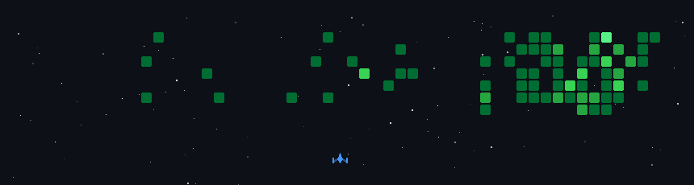
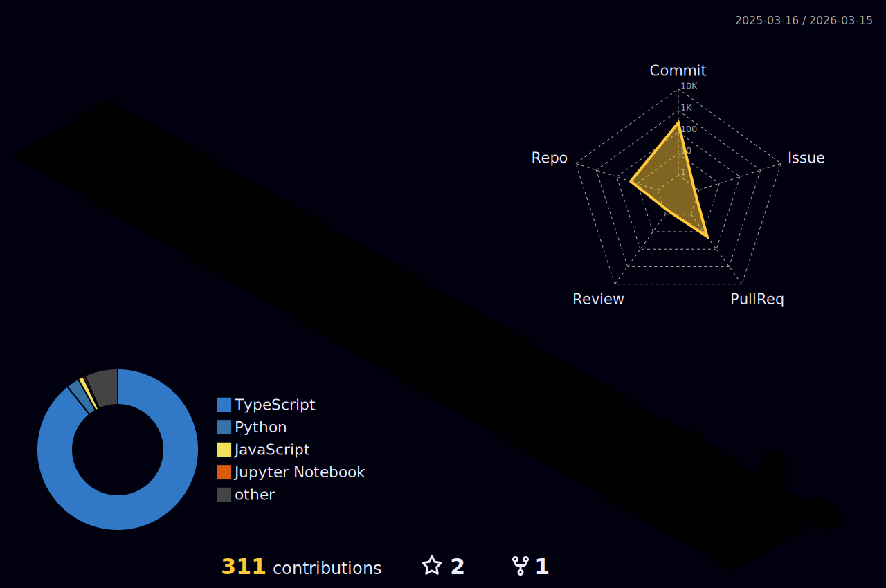

  

  

  
  
  

  
  
  
  
  
  
  
  
  

  🎓 대학생 개발자 · ☁️ 백엔드 좋아함 · 🧪 자동화/AI 실험 자주 함

  

  
  

  

  

<table>
  <tr>
    <td width="50%">
      
    </td>
    <td width="50%">
      
    </td>
  </tr>
</table>

  

  

  

